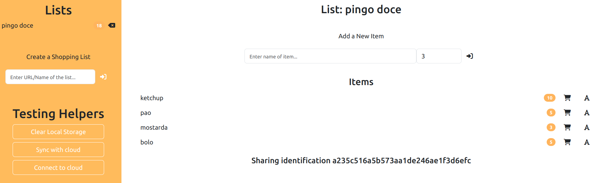
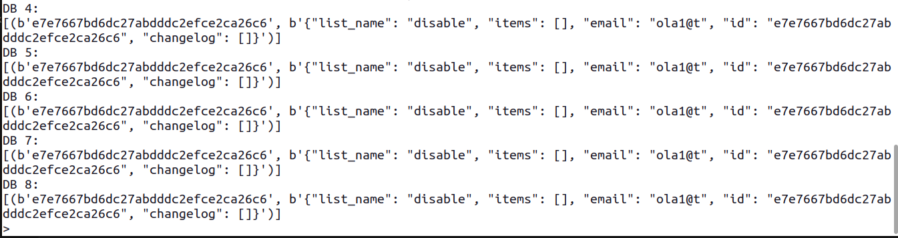
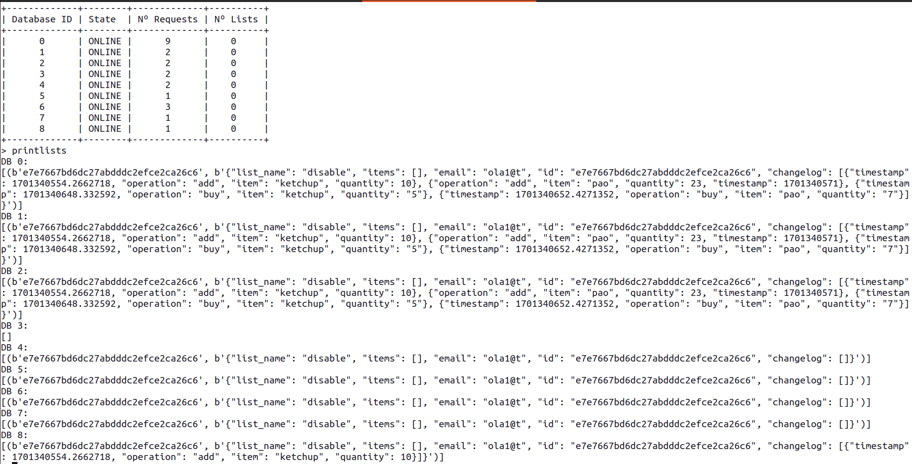
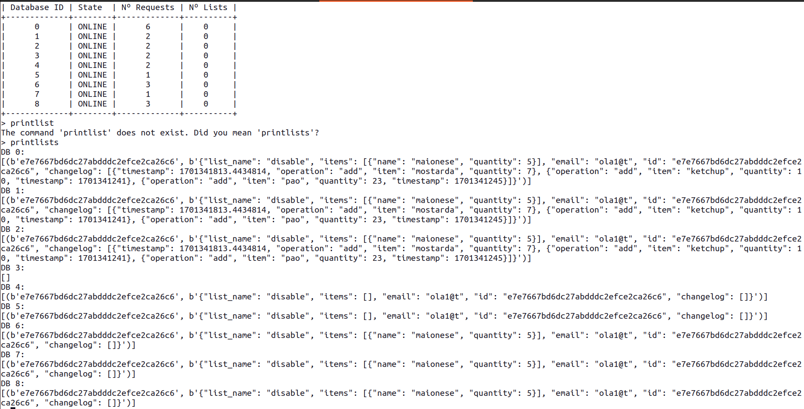

1: ligar o offline, criar lista, adicionar itens, comprar cenas, ligar ligacao, fazer sync: 
```
Exception in thread Requests Server Thread:
Traceback (most recent call last):
  File "/usr/lib/python3.10/threading.py", line 1016, in _bootstrap_inner
    self.run()
  File "/home/andre/Desktop/SDLE-Project/Server/Server_ZMQ.py", line 187, in run
    server.run()
  File "/home/andre/Desktop/SDLE-Project/Server/Server_ZMQ.py", line 176, in run
    response = self.request_handlers[request['type']](self.remove_attributes(request))
  File "/home/andre/Desktop/SDLE-Project/Server/Server_ZMQ.py", line 79, in synchronize
    main_database_id = self.hashing_ring.find_main_database_id(list_id)
  File "/home/andre/Desktop/SDLE-Project/Server/HashingRing.py", line 36, in find_main_database_id
    request_id_hash = int(request_id_hash, 16)
ValueError: invalid literal for int() with base 16: 'null'
```

# SOLUTION

backend is working. frontend is also working but the id only appears after reloading the page.


2: crio uma lista com merdas, partilho a lista, outro gajo adiciona cenas, faço sync: os items adicionados aparcem mas o contador à direita do nome da lista n atualiza.


3: crio uma lista e partilho com outro gajo: a lista aparece replicada em 5 dbs.


# FEITO

4: contador do numero de listas está avariado (operacoes várias de adicionar listas com dbs desligadas e assim):


# FEITO

6:
- criar lista "disable" e partilhar
- dar disable às dbs 4,5,6,7
- ligar offline
- adicionar 10 ketchup e 23 pao no browser q esta offline
- adicionar 5 maionese no browser online
- disable 8
- com outra conta e browser, aceder à lista "disable" e adicionar 7 mostardas
- ligar a ligacao no browser q estava offline (o q tinha ketchup e pao)
- fazer sync no browser recem ligado
- (all good so far: o browser tem ketchup, pao, mostarda, maionese)
- ligar todas as dbs (4, 5, 6, 7)
- fazer sync
- fodeu (todos os produtos desapareceram exceto a maionese): o merge n incluiu todas as instancias:

# FEITO

7:
- criar lista em browser 1
- meter browser 2 offline
- pegar no sharing id do browser 1 e tentar meter no browser 2
- não dá....

(em backend, eu acho que funciona tudo ao meter online e dar sync. acho que a questão é só mesmo frontend.)

8:
- não dá para apagar da BD listas atraves do frontend....



# FEITO

